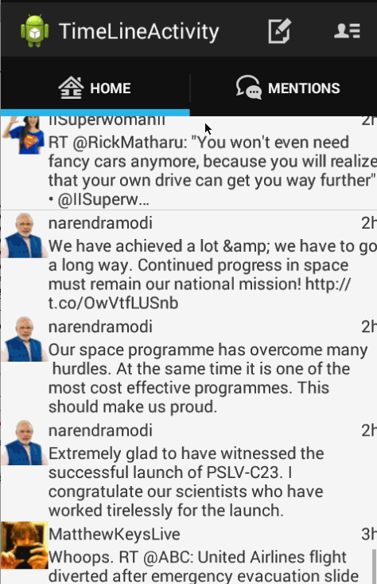

SimpleTwitterClient-Part 2
===================
1.Hours Spent : 7-8 hrs

2.User Stories:

- [X] Includes all required user stories from Week 3 Twitter Client
- [X] User can switch between Timeline and Mention views using tabs.
- [X] User can view their home timeline tweets.
- [X] User can view the recent mentions of their username.
- [X] User can scroll to bottom of either of these lists and new tweets will load ("infinite scroll")
- [ ] Optional: Implement this in a gingerbread-compatible approach
- [X] User can navigate to view their own profile
- [X] User can see picture, tagline, # of followers, # of following, and tweets on their profile.
- [X] User can click on the profile image in any tweet to see another user's profile.
- [X] User can see picture, tagline, # of followers, # of following, and tweets of clicked user.
- [X] Profile view should include that user's timeline
- [ ] Optional: User can view following / followers list through the profile

3.
